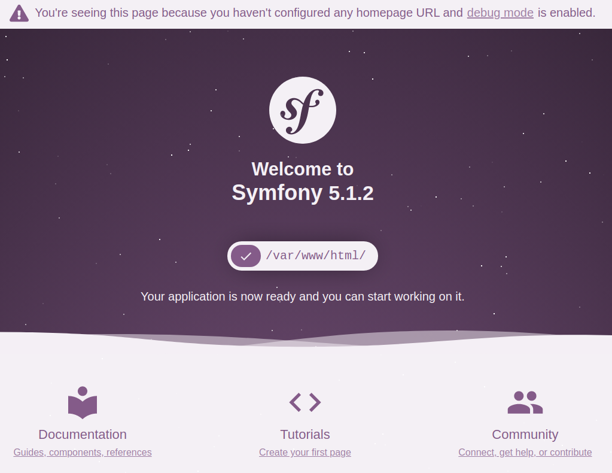

# Shopping API with Symfony, Node, Postgres and Docker

The main idea of this repository is to show you how to write an API and connect it with a UI client.
The repository has implemented two well known languages such as `PHP` and `Javascript`.

## Pre-Requisites to run this respository
- [Docker](https://docs.docker.com/get-docker/). After installation make sure you have the `docker.sock` in this path `/var/run/docker.sock` (Linux & Mac) 
- Then, you will need to add the following URLs to your `hosts`. In this step, you will need `root` privileges.
- Open the following file with your favorite text editor `/etc/hosts`
- Add these URLs, because we will need then in the next steps to get access from a browser.
```angular2 
127.0.0.1	shopping-app.docker
127.0.0.1	shopping-api.docker 
```

## How to build the containers
Having [Docker](https://docs.docker.com/get-docker/) installed and the URLs mapped is time to build the containers. This step will create four containers, but each of them has a purpose. Now please open your terminal and run the following commands.  
1. Clone the repository `git clone git@github.com:jeffctr/symfony-mic-api.git`
1. Go into the folder that the previous command has created `cd symfony-mic-api`
1. Run docker compose to build your images. This command will download the [docker images](https://docs.docker.com/get-started/overview/) required to build your containers. Please make sure you have an internet connection and be patient because it can take a while `docker-compose build`
1. After the previous command has finished, its time to start the containers `docker-compose up -d`
1. If everything was a success congratulation you have [Symfony 5.1](https://symfony.com/doc/current/setup.html) running in your local with a connection to [Postgres 10](https://www.postgresql.org/).

### Full commands to build and start the containers

```terminal
$ cd symfony-mic-api
$ docker-compose build # This command will build your docker image
$ docker-compose up -d # This command will start your containers
$ docker ps            # This command will show you the container that are currently running

# This is the output that you should see. 
CONTAINER ID        IMAGE                 COMMAND                  CREATED             STATUS              PORTS                    NAMES
4cbbbaf683f7        symfony-mic-api_app   "docker-entrypoint.s…"   49 seconds ago      Up 7 seconds        8080/tcp                 shopping-app
8b5ad2756e51        symfony-mic-api_php   "docker-php-entrypoi…"   50 seconds ago      Up 8 seconds        80/tcp, 8080/tcp         shopping-api
0207c7bc21c4        jwilder/nginx-proxy   "/app/docker-entrypo…"   53 seconds ago      Up 10 seconds       0.0.0.0:80->80/tcp       api-ngix
d1f2882dd5b6        postgres:10           "docker-entrypoint.s…"   53 seconds ago      Up 9 seconds        0.0.0.0:5432->5432/tcp   shopping-db 
```

The previous output means that everything is up and running. However, now you wonder why there are four containers running. Let me explain why.  
- `shopping-app` This container runs `NodeJS`
- `shopping-api` This container has `Symfony` microservice running with the API
- `shopping-db`  This container runs the Database in `Postgres 10`
- `api-ngnx`     This container runs the virtual host to make it possible to redirect your browser with the correct hostName.

#### Load data fixture
Now is time to load data into the database, it is a preset data. However, you will need to connect into the `shopping-api` container so run the following commands to make it possible. 
```terminal
$ docker exec -it shopping-api bash           # This command allows you to connect in the container
$ php bin/console doctrine:migrations:migrate # This command will run database migration  
$ php bin/console doctrine:fixtures:load      # This command will laod the data fixtures 
$ exit                                        # Close the container connection
``` 

### API home page
Finally, if everything runs smoothly you can go to this URL [http://shopping-api.docker](http://shopping-api.docker/index.php/) and check if the API is running, you should be able to see the Symfony welcome page as it shows in the following image. 




#### API end points
IF the container is running, and you have migrated the data previously you can start executing `GET` request. Let's test if it works. List all products stored in the database, go to this URL [List All Products](http://shopping-api.docker/index.php/products).

However, that does not look good because that is not readable, so open the UI client [shopping-app](http://shopping-app.docker/) to display the data or insert new products with method `POS` at the bottom of the page there is a form where you can insert new products. You should be able to list all products. 


 

## Important commands 
```terminal
$ docker-compose down               # This command will stop all container that you started previously
$ docker exec -it shopping-db bash  # This command will allow you to connect to the DB container 
    $ psql shopping admin           # This command allow you to connect to the DB 
    $ SELECT * FROM products        # This command will display products list
    $ \q                            # Close DB connection
    $ exit                          # Close container connection

$ docker exec -it shopping-app bash  # This command will allow you to connect to the app container 
    $ npm run build:sass             # This command will build the css main.min.css & main.css
```

## Main Files
The main file that makes the UI to work in the `app.js` located in `symfony-mic-api/app/code/src/js/app.js`. This file contains the main logic to get data from the API and insert, it has a class that controls the whole logic, as well as the variables that will remain in session if you add any product to the cart. 

The UI is working with `sass` and you can find the structure in `symfony-mic-api/app/code/src/scss`

The main file for makes to work in the  API is the `ProductController.php` located in `symfony-mic-api/code/src/Controller`. This file has the routing and accepts the different requests. 

